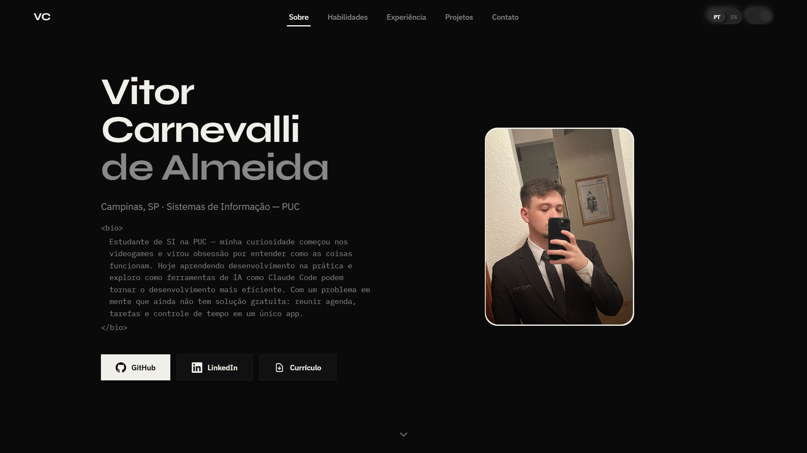

# Vitor Carnevalli — Portfolio

Portfolio pessoal de desenvolvedor com dark mode, dois idiomas e animações performáticas.

[](https://github.com/vitorCarnevalli/portfolio/actions/workflows/deploy.yml)


🌐 **[vitorcarnevalli.github.io/portfolio](https://vitorcarnevalli.github.io/portfolio)**

---

## Visão geral

SPA em React com seções de apresentação, habilidades, experiência e projetos. Alterna entre português e inglês sem recarregar a página. Dark mode persiste entre sessões. Todas as animações respeitam `prefers-reduced-motion`.

O projeto **Andrea Engenharia** inclui um slider de antes/depois interativo para comparar o site antigo com o novo. Projetos abrem em modal com imagens e links diretos.



---

## Stack

| Camada | Tecnologia |
|---|---|
| UI | React 19 + TypeScript |
| Build | Vite 8 |
| Estilo | Tailwind CSS 4 |
| Animações | Framer Motion |
| Scroll | Lenis |
| Deploy | GitHub Pages via Actions |

---

## Arquitetura

Para entender o projeto por dentro — fluxo de dados, decisões técnicas, convenções de imagem e pipeline de deploy — leia o [`ARCHITECTURE.md`](ARCHITECTURE.md).

---

## Começando

**Pré-requisitos:** Node 22+

```bash
git clone https://github.com/vitorCarnevalli/portfolio.git
cd portfolio
npm install
npm run dev
```

Acesse `http://localhost:5173`. Não há variáveis de ambiente necessárias.

---

## Comandos

```bash
npm run dev      # Servidor de desenvolvimento em localhost:5173
npm run build    # Type-check + build de produção em dist/
npm run lint     # ESLint
npm run preview  # Servir o build de produção localmente
```

---

## Atualizar conteúdo

| O que atualizar | Onde |
|---|---|
| Habilidades e nível | `src/data/skills.ts` |
| Projetos | `src/data/projects.ts` |
| Experiência e formação | `src/i18n/pt.json` e `src/i18n/en.json` — chaves `experience.*` |
| Textos gerais | `src/i18n/pt.json` e `src/i18n/en.json` |
| Foto de perfil | `public/profile.jpeg` |
| Currículo | `public/curriculo.pdf` |

> [!NOTE]
> Todo texto novo deve ser adicionado nos dois arquivos de i18n para funcionar nos dois idiomas.

---

## Imagens

Use **WebP** para manter o bundle leve. Para converter:

```bash
npm install --save-dev sharp
node -e "require('sharp')('input.png').webp({ quality: 82 }).toFile('output.webp').then(console.log)"
npm uninstall sharp
```

---

## Deploy

O deploy é automático via GitHub Actions a cada push na branch `main`. O workflow faz build com Node 22, roda `npm audit --audit-level=high` e publica em GitHub Pages.

Para deploy manual, suba o conteúdo de `dist/` para qualquer host estático.

> [!WARNING]
> O `base` em `vite.config.ts` está configurado como `/portfolio/`. Se hospedar em domínio próprio na raiz, altere para `base: '/'`.
